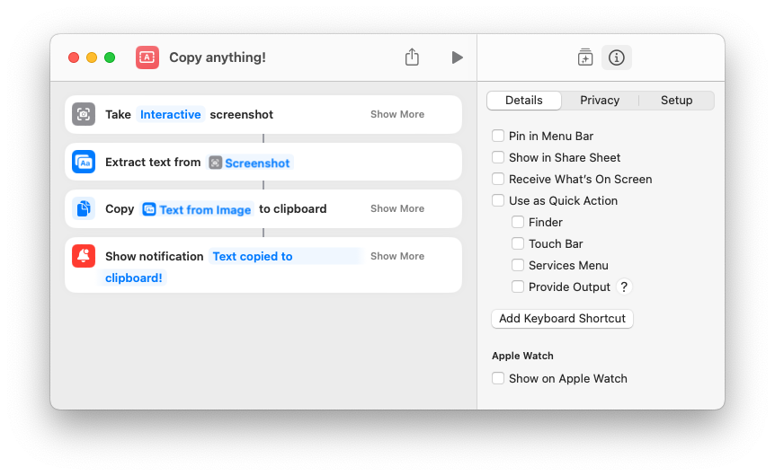

I don't know about you, but I often find myself wanting to copy some text that isn't copyable! This usually occurs if the text in question is part of an application's UI, for example. To solve this, I created a [handy shortcut](https://www.icloud.com/shortcuts/ef96ddc9a9074b83ac0072f839fe4c39) that allows you to select an area of your screen and extract any text in that area to your clipboard ✨

You can integrate this into your workflow by assigning the shortcut to a keyboard shortcut. I used `Command + Shift + 7` to bring it next to the existing keyboard shortcuts for taking screenshots.
