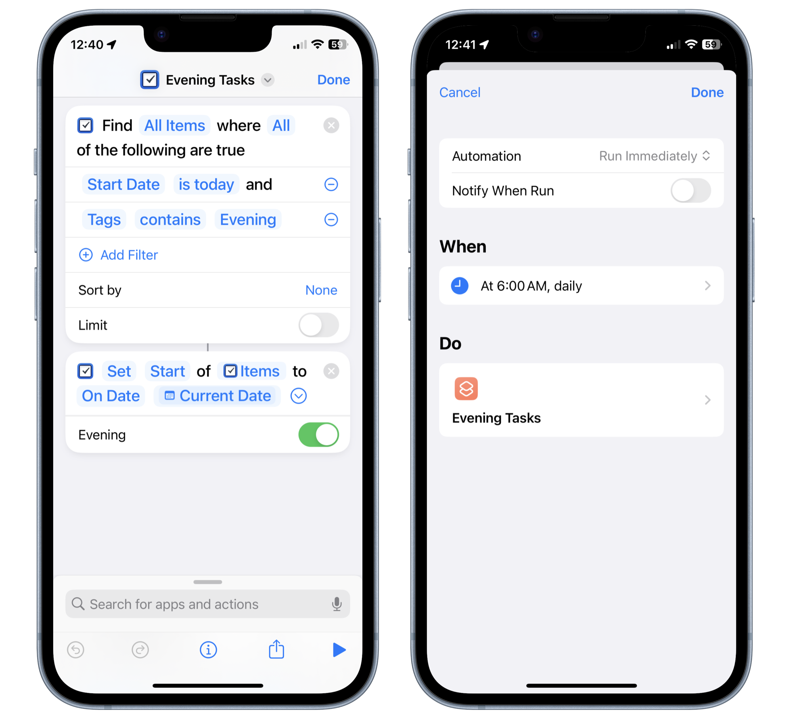

One feature that has been missing from my favorite todo app, [Things 3](https://culturedcode.com/things/), has been the ability to automatically move tasks to the _Evening_ section when they appear on the _Today_ page. With the power of shortcuts, we can fix this!

1. [Click here to download the shortcut](https://www.icloud.com/shortcuts/875aceaf10084b91945eb8150e5a40f2).
2. Create an automation to run the shortcut everyday.

The way it works is you mark tasks you want to appear in _Evening_ with a tag called "Evening" (you can change that to whatever you want) and, voilà, everyday the automation will move todays tasks tagged with "Evening" into the _Evening_ section!

---

_231020: Just realized that setting the automation to run whenever you open Things 3 also works great!_
